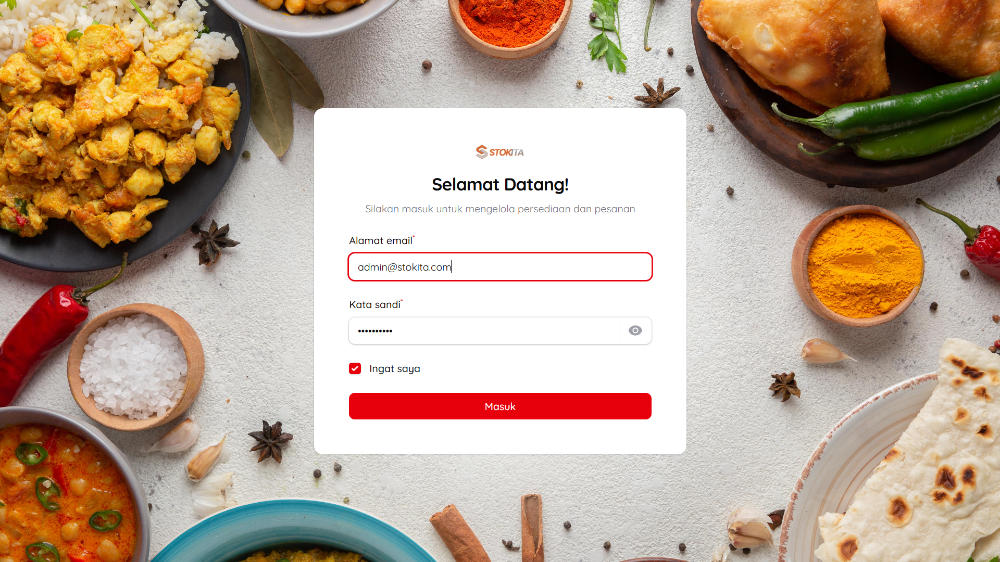
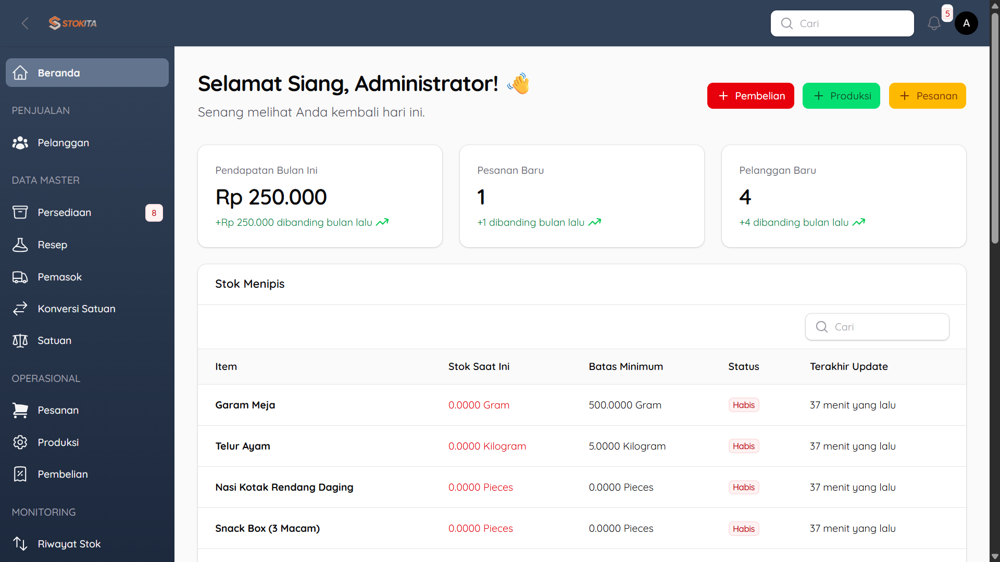
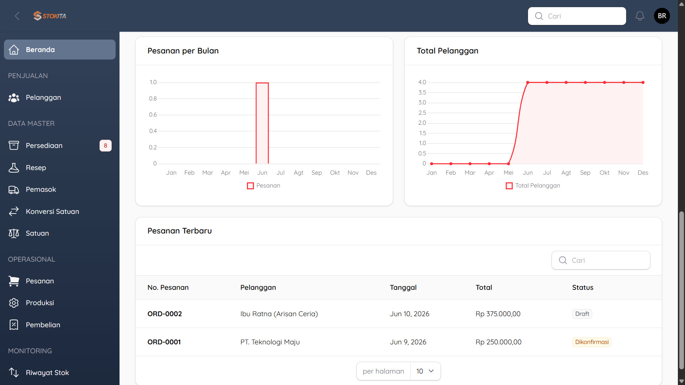
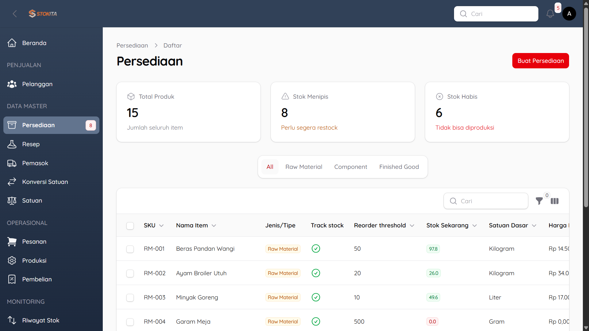
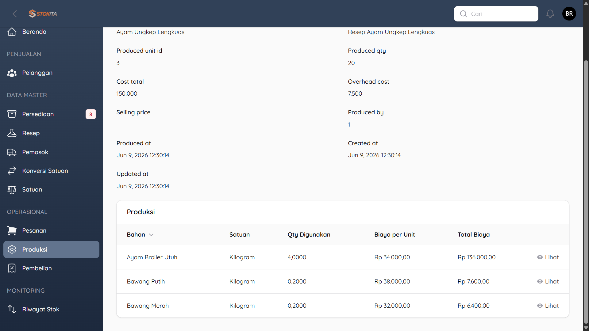
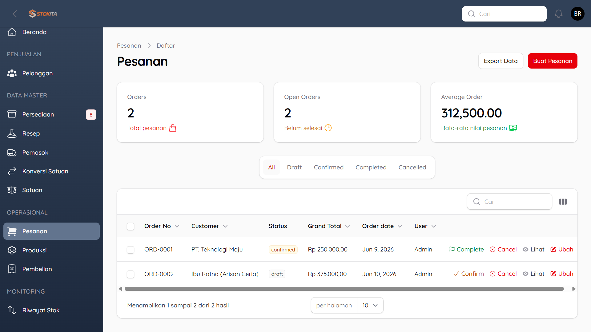
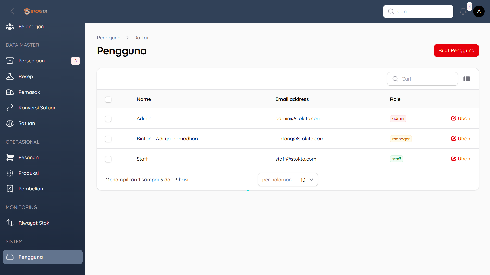
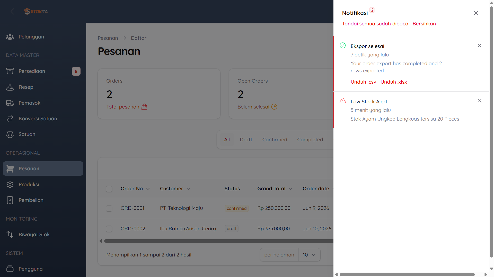

# Stokita - Catering Inventory & Production Management System

Stokita adalah aplikasi manajemen inventaris dan produksi terintegrasi yang dirancang khusus untuk kebutuhan bisnis katering. Proyek ini mendemonstrasikan implementasi alur kerja SCM pada ERP (Enterprise Resource Planning) yang kompleks, mulai dari pengadaan bahan baku, manajemen resep bertingkat (Bill of Materials), hingga pemrosesan pesanan pelanggan secara real-time.

🌐 **Demo Live**: [https://stokita-ims.vercel.app](https://stokita-ims.vercel.app)

## 🚀 Fitur Utama

- **Manajemen Inventaris Multi-Level**: Mendukung tiga tipe barang:
    - **Raw Material**: Bahan baku dasar (contoh: Beras, Ayam, Sayuran).
    - **Component**: Bahan setengah jadi hasil produksi internal (contoh: Sambal, Ayam Ungkep).
    - **Finish Good**: Produk akhir siap jual (contoh: Nasi Kotak).
- **Bill of Materials (BoM) & Recipes**: Struktur resep bertingkat yang memungkinkan bahan setengah jadi digunakan sebagai komponen produk akhir.
- **Siklus Produksi Otomatis**: Fitur produksi yang otomatis memotong stok bahan baku/komponen dan menambah stok produk jadi berdasarkan resep, lengkap dengan kalkulasi biaya rata-rata (Average Costing).
- **Manajemen Pembelian (Procurement)**: Pencatatan pembelian dari supplier yang secara otomatis memperbarui stok dan menghitung harga pokok barang.
- **Sistem Penjualan (Order)**: Pemrosesan pesanan pelanggan dengan status bertingkat (Draft, Confirmed, Completed) yang terintegrasi dengan pengurangan stok produk jadi.
- **Pelacakan Stok (Stock Movements)**: Log komprehensif untuk setiap perubahan stok (Masuk, Keluar, Produksi, Penjualan).
- **Role & Permission**: Manajemen hak akses menggunakan Spatie Laravel Permission (Admin, Manager, Staff).

## 📸 Screenshots

> **Beberapa Screenshot dari Aplikasi**.

### 🔐 Halaman Login


_Tampilan halaman login._

### 🖥️ Dashboard & Statistik



_Tampilan ringkasan stok rendah, pesanan terbaru, dan statistik pendapatan._

### 📦 Manajemen Inventaris & BoM


_Daftar item katering dengan kategori Raw Material, Component, dan Finish Good._

### 🍳 Proses Produksi


_Detail produksi yang secara otomatis memotong stok bahan baku berdasarkan resep._

### 🧾 Transaksi Penjualan


_Manajemen pesanan pelanggan terintegrasi dengan pengurangan stok produk jadi._

### ⚙️ Management User


_Manajemen pesanan pelanggan terintegrasi dengan pengurangan stok produk jadi._

### 🔔 Notifikasi


_Manajemen pesanan pelanggan terintegrasi dengan pengurangan stok produk jadi._

## 🛠️ Tech Stack

- **Framework**: [Laravel 12](https://laravel.com/)
- **Admin Panel**: [Filament v4](https://filamentphp.com/) (TALL Stack: Tailwind, Alpine.js, Laravel, Livewire)
- **Database**: MySQL
- **Role Management**: [Spatie Laravel Permission](https://spatie.be/docs/laravel-permission/)
- **Utility**: Laravel Service Pattern, Model Observers, Unit Conversions.

## 📐 Arsitektur & Konsep Teknis

Proyek ini menonjolkan beberapa pola desain dan konsep teknis tingkat lanjut:

- **Service Pattern**: Logika bisnis yang kompleks (seperti Produksi dan Penjualan) dipisahkan ke dalam kelas Service khusus untuk menjaga kontroler tetap bersih dan kode mudah diuji.
- **Model Observers**: Digunakan untuk menangani efek samping data secara otomatis, seperti penghitungan `line_total` pada item transaksi atau pembaruan stok otomatis.
- **Unit Conversion Engine**: Sistem cerdas yang mampu menangani konversi antar satuan (misal: beli dalam KG, pakai dalam GR) secara otomatis dalam kalkulasi stok.
- **Average Costing Method**: Penghitungan harga pokok barang yang dinamis berdasarkan histori pembelian terbaru.

## 📋 Prasyarat

- PHP >= 8.2
- Composer
- Node.js & NPM

## ⚙️ Instalasi

1. Clone repositori:

    ```bash
    git clone https://github.com/bintangarama/stokita.git
    cd stokita
    ```

2. Instal dependensi PHP:

    ```bash
    composer install
    ```

3. Instal dependensi Frontend:

    ```bash
    npm install
    npm run build
    ```

4. Konfigurasi Environment:

    ```bash
    cp .env.example .env
    php artisan key:generate
    ```

    _Jangan lupa atur database di file `.env`._

5. Jalankan Migrasi & Seeder:
    ```bash
    php artisan migrate --seed
    ```
    _Seeder akan membuat akun admin, satuan, data item katering, supplier, customer, hingga simulasi transaksi pembelian dan produksi._

## 🔑 Akses Default (Data Seeder)

- **Demo Live**: [https://stokita-ims.vercel.app](https://stokita-ims.vercel.app)
- **Local URL**: `http://localhost:8000/login`
- **Email**: `admin@stokita.com`
- **Password**: `adminadmin`

## ☁️ Deployment & Database
Aplikasi ini dideploy dengan arsitektur modern:
- **Application Server**: [Vercel](https://vercel.com/) (menggunakan Serverless Functions PHP)
- **Database Server**: MySQL yang di-host pada VPS Pribadi (dioptimalkan untuk akses remote dengan latensi rendah dari region Vercel Singapore `sin1`)

---

**Project by Bintang Aditya Ramadhan** - Dikembangkan sebagai tugas kuliah dan demonstrasi keahlian dalam pengembangan aplikasi enterprise SCM menggunakan ekosistem Laravel modern.
